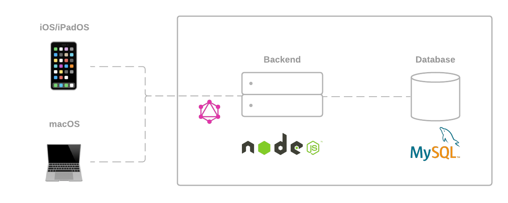
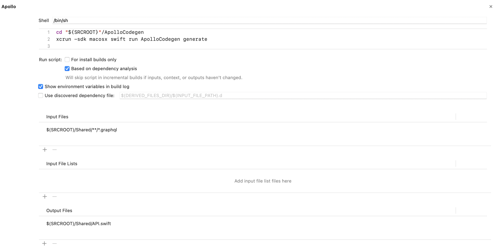

# Statusdeck

Third exercise for the subject 20_SVE2UE at FH OÖ Campus Hagenberg. The exercise is based on the Apollo NodeJS and iOS implementation.


## tl;dr

*tbd*

## 🚩 Goal

Create a GraphQL API and a client for CI/CD pipelines. Enables querying pipelines, builds, steps, commits in a build. The required CI/CD pipeline data will only be simulated.

## 🏗 Architecture



The application itself is based on a three-tier architecture. The backend, written in NodeJS, uses MySQL to persist the data and offers a GraphQL endpoint for a multiplatform SwiftUI app.

## 📝 Requirements

* `docker`
* `node`
* `xcodebuild`

## 🚀 Get started

1. Start the backend and the client
```sh
make bootstrap
```

2. Insert test data
```sh
make test-data
```

## 💻 Implementation

## Client

### Code Generation
The Apollo Client for iOS uses Swift scripting to perform certain operations that otherwise require the command line. The main features are:

* Downloading a schema
* Generating Swift code for model objects based on the schema and operations

The configuration itself are set in a cloned ApolloCodegen project:

```bash
.
├── Mintfile
├── README.md
└── statusdeck
	├── ApolloCodegen
	│   ├── ApolloCLI
	│   ├── Package.resolved
	│   ├── Package.swift
	│   ├── README.md
	│   ├── Sources
	│   └── Tests
	├── Shared
	│   ├── API.swift
	│   ├── ...
	├── Statusdeck.xcodeproj
	├── iOS
	└── macOS
```

A Xcode run script phase then checks all the provided `.graphql` files and generates the API when building the application:



The generated classes can then be found in the `API.swift` file:

```swift
// API.swift

public final class JobQuery: GraphQLQuery {
  /// The raw GraphQL definition of this operation.
  public let operationDefinition: String =
	"""
	query Job($jobId: ID!) {
	  job(id: $jobId) {
		__typename
		id
		name
		startedAt
		finishedAt
		state
		logs
		...
	  }
	}
	"""

  public let operationName: String = "Job"

  public let operationIdentifier: String? = "68e5d86f4f23b1e51d62dbca217f67bab5ee6039e001160cdbd03f492b88a40c"

  public var jobId: GraphQLID

  public init(jobId: GraphQLID) {
	self.jobId = jobId
  }

  public var variables: GraphQLMap? {
	return ["jobId": jobId]
  }

  public struct Data: GraphQLSelectionSet {
	public static let possibleTypes: [String] = ["Query"]

	public static var selections: [GraphQLSelection] {
	  return [
		GraphQLField("job", arguments: ["id": GraphQLVariable("jobId")], type: .object(Job.selections)),
	  ]
	}
	
	// ...
  }
}
```

### Apollo vs ApolloCombine
Alongside SwiftUI as a UI framework, Combine was also used. The Apple developer documentation describes it as follows:
> The Combine framework provides a declarative Swift API for processing values over time.

This approach is similar to known frameworks like ReactiveX (RxSwift, RxJS, etc.) or ReactiveCocoa. To make use of this framework ApolloCombine on top of Apollo was used. This library provides extensions to the ApolloClientProtocol and instead of including a result handler, these methods return Combine publishers that deliver the results of the operation to subscribers which can be seen below.

**Plain Apollo**
```swift
@Published var pipelines: [PipelinesQuery.Data.Pipeline] = []

client.fetch(query: PipelinesQuery(), cachePolicy: .returnCacheDataAndFetch) { [weak self] result in
	guard let self = self else { return }
	
	switch result {
	case .success(let graphQLResult):
		DispatchQueue.main.async { [unowned self] in
			self.pipelines = graphQLResult.data?.pipelines ?? []
		}
	case .failure(let error):
		self.error = error
		self.loading = false
	}
}
```

**ApolloCombine**
```swift
@Published var pipelines: [PipelinesQuery.Data.Pipeline] = []

...

client.fetchPublisher(query: PipelinesQuery(), cachePolicy: .returnCacheDataAndFetch)
	.receive(on: DispatchQueue.main)
	.sink(receiveCompletion: { [weak self] completion in
		guard let self = self else { return }
		if case let .failure(error) = completion {
			self.error = error
		}
		self.loading = false
		}, receiveValue: { [weak self] graphQLResult in
		guard let self = self else { return }
		self.pipelines = graphQLResult.data?.pipelines ?? []
		})
	.store(in: &subscriptions)
```

## Server

*tbd*

## 📱 Showcase

