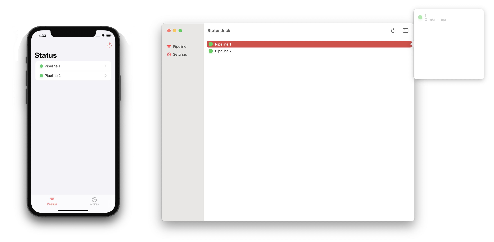

# Statusdeck

Third exercise for the subject 20_SVE2UE at FH OÖ Campus Hagenberg. The exercise is based on the Apollo NodeJS and iOS implementation.

## tl;dr

*tbd*

## 🚩 Goal

Create a GraphQL API and a client for CI/CD pipelines. Enables querying pipelines, builds, steps, commits in a build. The required CI/CD pipeline data will only be simulated.

## 🏗 Architecture

*tbd*

## 📝 Requirements

*tbd*

## 🚀 Get started

*tbd*

## 📱 Showcase

